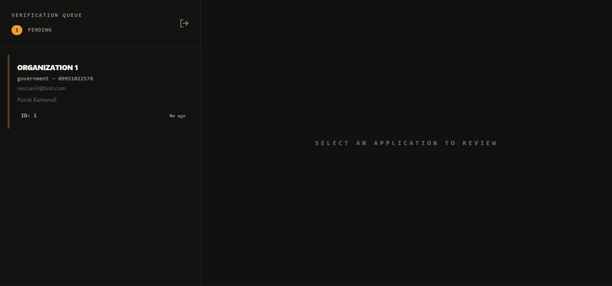
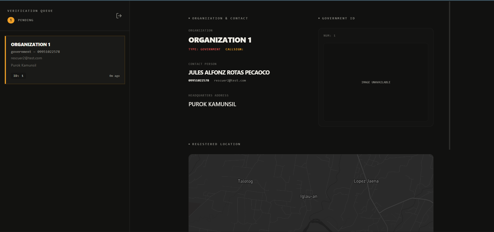
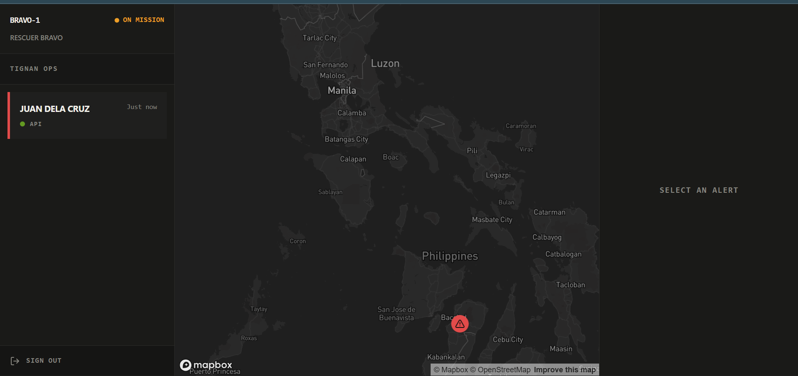
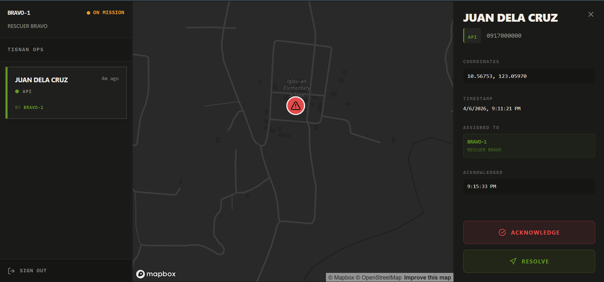
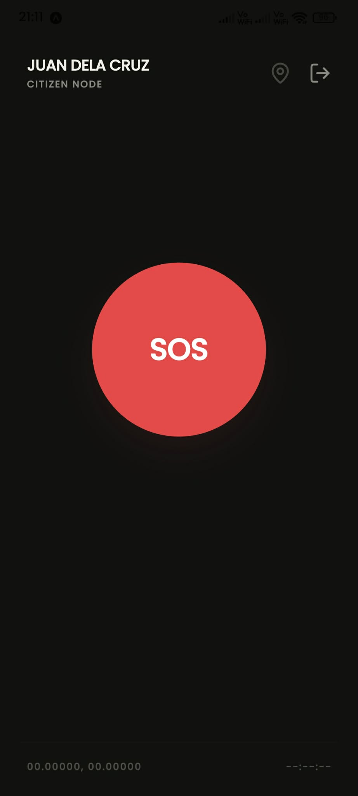
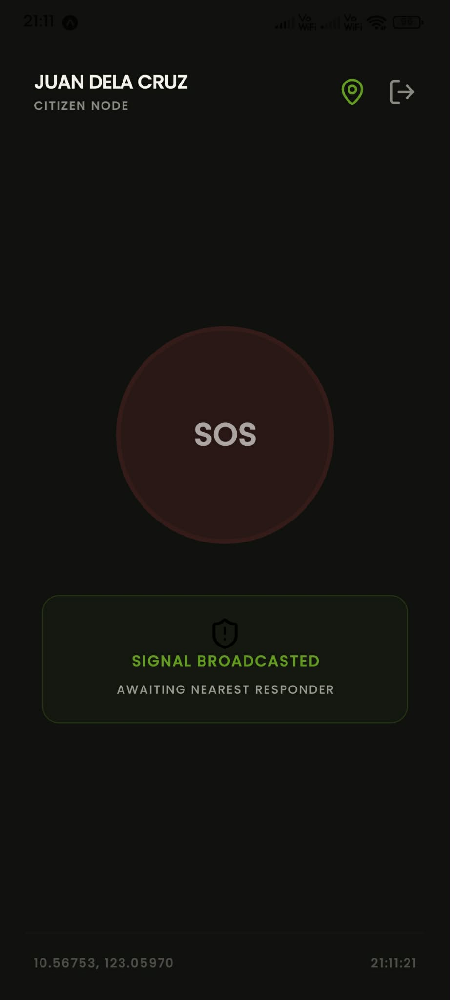

# Tignan: SOS and Emergency Response System

_Kita ang Aksyon sa Krisis._

> **Official Entry for Komsai Hack 2026: RiskReady**

Tignan is a real-time emergency response platform built to streamline citizen safety and incident management. It was developed to answer the call of _RiskReady: Tech Solutions for Disaster Readiness_, aiming to empower communities and increase awareness of disaster risk reduction and management.

## 🔎 The Challenge

The Komsai Hack 2026 required a solution to support people during emergencies and promote resiliency in times of crisis.

Tignan addresses this by connecting people directly to the nearest available support groups. It provides a unified system where:

- **Citizens** can broadcast emergency alerts with their exact location.
- **Rescuers** get fast-tracked dispatch information so they can arrive faster.
- **Command centers** have a live map-based view to orchestrate the response.

By linking these parties efficiently, we hope to foster a more disaster-ready community.

## ✨ Features

- **Real-time SOS Alerting** — Instant emergency triggers with location tracking.
- **Dynamic Dispatching** — Route incidents to the nearest available responders.
- **Live Monitoring** — Map-based dashboard for managing incidents and rescuer teams.
- **Incident Management** — Track everything from the initial alert creation until the patient is safe.

## 🛠️ Technical Stack

Tignan is a monorepo spanning web and mobile:

| Directory | Description | Tech |
|-----------|-------------|------|
| `admin/` | Web-based command center | React, Vite, Tailwind CSS |
| `rescuer/` | Web-based rescuer dashboard | React, Vite, Tailwind CSS, Mapbox |
| `user/` | Mobile app for citizens | Expo, NativeWind |
| `schema/` | Database & backend | Supabase |

## 🔑 Demo Access

Try the live applications using the test accounts below.

| App | Link | Email | Password |
|-----|------|-------|----------|
| **Rescuer** (Web) | [tignan-rescuer.vercel.app](https://tignan-rescuer.vercel.app) | `rescuer@test.com` | `password123` |
| **Admin** (Web) | [tignan-admin.vercel.app](https://tignan-admin.vercel.app) | `admin@test.com` | `password123` |
| **User** (Android) | [Download APK](https://example.com/tignan.apk) | `user@test.com` | `password123` |

## 📸 Screenshots

### Admin Dashboard

| Pending Rescuer Applications | Rescuer Details |
|---|---|
|  |  |

### Rescuer Dashboard

| Active Incidents | Map Navigation |
|---|---|
|  |  |

### User Mobile App

| SOS Screen | Location Tracking |
|---|---|
|  |  |

## 🚀 Future Expansions

While the current iteration focuses on core SOS alerting and routing, there are several planned incremental updates:

- **In-App Chat Communication** — Direct messaging between the citizen in distress and the assigned rescuer for ongoing updates and first-aid instructions.
- **Push Notifications** — Background push notifications to alert rescuers immediately, even when the app is closed.
- **Offline SMS Fallback** — Allow users without internet access to trigger an SOS alert via standard SMS.
- **Multi-Language Support** — Support for local dialects (e.g., Tagalog, Cebuano) for broader accessibility.
- **Enhanced Role Management** — Granular roles such as dispatchers, field commanders, and system administrators.

## 🙏 Acknowledgements

This project was developed with the assistance of AI tools for documentation, scaffolding, planning, and assisted coding:

- Claude
- Gemini
- ChatGPT

---

  <em>Built with Love for Komsai Hack 2026: RiskReady</em> 
  <strong>Team Semicolon</strong>

